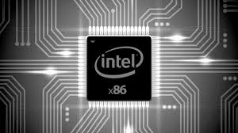

**PERFORMANCE AND TO POWER AMAZING EXPERIENCE FOR GAMING G SERIES**

Dragon is a distro kernel replacement built using the best configuration and kernel sources for desktop, multimedia, and gaming workloads.


<picture>
    <source srcset="images/dragon.webp" type="image/webp">
    
</picture>

[](https://github.com/RichardLitt/standard-readme)
[](https://en.cryptobadges.io/donate/1KvWrbLhuzk8DSb2Yq2948bMj3uQvVTQCW)
[](https://en.cryptobadges.io/donate/0xE42f2d4D4aF888Ac784ED26a68E828475A4712Cb)


---

<!--html_preserve-->

<script>
  (function() {
    var cx = 'partner-pub-4314805673333081:4559596035';
    var gcse = document.createElement('script');
    gcse.type = 'text/javascript';
    gcse.async = true;
    gcse.src = 'https://cse.google.com/cse.js?cx=' + cx;
    var s = document.getElementsByTagName('script')[0];
    s.parentNode.insertBefore(gcse, s);
  })();
</script>
<gcse:search></gcse:search>

<!--/html_preserve-->


By default, Ubuntu systems run with the Ubuntu kernels provided by the Ubuntu repositories. However it is handy to be able to test with modified upstream kernels to help locate problems in the Ubuntu kernel patches, or to confirm that upstream has fixed a specific issue. To this end i now offer select upstream kernel builds. These kernels are made from modified kernel source but using the Ubuntu kernel configuration files. These are then packaged as Ubuntu .deb files for simple installation.

Ubuntu’s stock Linux kernel is fine for most users, but because Ubuntu follows a six-month release cycle, their kernels are always a release or three behind upstream. This can cause problems for users attempting to install Ubuntu on brand new hardware, or worse, force ultra-nerds to wait to play with the latest and greatest new kernel features!

All workstations that I use today — a [MSI GT80-2QE-Titan-SLI (Broadwell)](https://www.msi.com/Laptop/GT80-2QE-Titan-SLI/Specification), [Dell Inspiron N5010 (Westmere)](https://technoish.com/dell-inspiron-n5010-review/) and [Acer Aspire SW5-012/Fendi2 Z3537F (Atom)](https://www.cnet.com/products/acer-aspire-switch-10-sw5-012-12l7-10-1-atom-z3735f-2-gb-ram-32-gb-ssd/specs/)  - boots Dragon kernels instead. Dragon’s kernels mirror the upstream development cycle, and as a bonus, include a number of exciting optimizations and patches to improve performance and expose up-and-coming features.

[One recent patch](https://github.com/graysky2/kernel_gcc_patch) pulls in the ability to utilize architecture-specific GCC optimizations when compiling a kernel. In general, compiler optimizations may not have much effect on runtime performance, however with something as foundational as a kernel, tiny improvements might add up quickly.

The Linux kernel is a very large piece of software. It contains drivers and special handling for all sorts of disparate hardware combinations. By and large, this is a good thing; it allows all sorts of different machines to boot a Linux kernel without undo fiddling. Pre-compiled kernels — like Ubuntu stock or Dragon — keep most of this code around because they cannot anticipate the kind of hardware their users might be using.


---


**Main Features:**

 - Experience a whole new way to interact with your PC like never before. 
 - Full kernel adaptation to version **Ubuntu 18.10 Cosmic.**
 - Full kernel adaptation to build GCC 8.2
 - Optimized to take full advantage of high-performance.
 - Supports all recent 64-bit versions of Debian and Ubuntu-based systems. 
 - Tuned CPU for Intel i5/i7/Atom platform.
 - PDS CPU Scheduler & Multi-Queue I/O Block Layer w/ BFQ-MQ for smoothness and responsiveness.
 - UKSM - Ultra Kernel Samepage Merging.
 - Caching, Virtual Memory Manager and CPU Governor Improvements.
 - General-purpose Multitasking Kernel.
 - Built on the latest GCC 8.2
 - DRM Optimized Performance.
 - Intel CPUFreq (P-State passive mode).
 - ZFS, AUFS, BFQ and Ureadahead support available.


**New features Dragon kernel distribution with custom settings:**

- **AVL Interactive Tuning**: Tunes the kernel for responsiveness at the cost of throughput and power usage.
- **PDS CPU Scheduler**: Fair process scheduler for gaming, multimedia, and real-time loads.
- **Preemptible tree-based hierarchical RCU**: RCU implementation for real-time systems.
- **Hard Kernel Preemption**: Most aggressive kernel preemption before requiring real-time patches. Guarantees responsive system under high intensity mixed workload scenarios.
- **Budget Fair Queue**: Proper disk scheduler optimized for desktop usage, high throughput / low latency.
- **TCP BBR Congestion Control**: Fast congestion control, maximizes throughput, guaranteeing higher speeds than Cubic.
- **Smaller TX Net Queues**: Reduced queue size on network devices to combat buffer bloat.
- **Ubuntu ureadahead Support**: Compatible with Ubuntu's readahead.
- **Binary Compatibility Cross Distro**: Compatible with Debian Testing and newer as well as latest Ubuntu. Worst case, a package rebuild will be required on older distributions.
- **Distribution Kernel Drop-in Replacement**: Proper distribution style configuration supporting broadest selection of hardware. Paravirtualization options enabled to reduce overhead under virtualization.
- **Minimal Debugging***: Minimum number of debug options enabled to increase kernel throughput.

---

[]()
 
## Full security support:
 
 - Indirect Branch Restricted Speculation (IBRS)
 - Indirect Branch Prediction Barrier (IBPB)
 - L1TF/Foreshadow Mitigations

---

[]()
 
## The Ultra Kernel Samepage Merging feature (UKSM)
 
 - This is an improvement upon ([KSM](https://www.kernel.org/doc/html/latest/admin-guide/mm/ksm.html)). 
   Some basic data structures and routines are borrowed from KSM.

---

[]()
 
## OpenZFS ([ZFS](http://open-zfs.org/wiki/Main_Page))
 
 OpenZFS is an outstanding storage platform that encompasses the functionality of traditional filesystems,
volume managers, and more, with consistent reliability, functionality and performance.
 
 - The module ZFS is integrated into the kernel.

#### Warning! This kernel implement ZFS version 0.7.11.

Packages for this version strictly install from my repository!

To install ZFS, head to a terminal and run the following command:

```bash
$ sudo add-apt-repository ppa:lavrandy/zfs-linux
$ sudo apt-get update
$ sudo apt install zfsutils-linux
$ sudo reboot
```

---

[]()
 
## Advanced multi layered Unification File System ([AUFS](https://en.wikipedia.org/wiki/Aufs))
 
 AUFS (short for advanced multi-layered unification filesystem) implements a union mount for Linux file systems.
The name originally stood for AnotherUnionFS until version 2.
 
 - The module AUFS is integrated into the kernel.

---

[](http://www.openwall.com/lkrg/)

## Linux Kernel Runtime Guard ([LKRG](http://www.openwall.com/lkrg/))

 Linux Kernel Runtime Guard (LKRG) is a loadable kernel module that
performs runtime integrity checking of the Linux kernel and detection of
security vulnerability exploits against the kernel.

 - The module LKRG is integrated into the kernel.

---

[](http://linux-test-project.github.io/)

## Kernel tested by - [Linux Test Project](http://linux-test-project.github.io/)

 **Linux Test Project** is a joint project started by SGI, developed and maintained by IBM, Cisco, Fujitsu, SUSE, Red Hat and others, that has a goal to deliver test suites to the open source community that validate the reliability, robustness, and stability of Linux. The LTP testsuite contains a collection of tools for testing the Linux kernel and related features.


- [Linux Dragon Kernel testing report](https://dragon-kernel.pro/report)


---

## Install Dragon Kernel

[](https://downloadcenter.intel.com/download/27591/Linux-Processor-Microcode-Data-File)

Update Intel microcode for use IBRS/IBPB:

[](https://downloadcenter.intel.com/download/27591/Linux-Processor-Microcode-Data-File)


[](https://launchpad.net/~wip-kernel)


**Sources are on Launchpad. You can see and check them. From these sources, buildbox Launchpad builds packages in a clean environment. Everything is officially and verified by Launchpad and Canonical.**

[Source in the project page menu, click Code](https://launchpad.net/~wip-kernel)

[Source code direct link](https://git.launchpad.net/ubuntu-wip-kernel)


Install the packages from Launchpad PPA “Linux WIP-Kernel” Team:

**Quick install**

**For Dragon GENERIC kernel:**

```bash
$ sudo add-apt-repository ppa:wip-kernel/generic
$ sudo apt-get update
$ sudo apt install linux-headers-4.19.2-dragon linux-headers-4.19.2-dragon-generic linux-image-unsigned-4.19.2-dragon-generic linux-modules-4.19.2-dragon-generic linux-modules-extra-4.19.2-dragon-generic
$ sudo reboot
```

**For Dragon Lowlatency kernel:**

```bash
$ sudo add-apt-repository ppa:wip-kernel/generic
$ sudo apt-get update
$ sudo apt install linux-headers-4.19.2-dragon linux-headers-4.19.2-dragon-lowlatency linux-image-unsigned-4.19.2-dragon-lowlatency linux-modules-4.19.2-dragon-lowlatency linux-modules-extra-4.19.2-dragon-lowlatency
$ sudo reboot
```

**For Dragon Westmere kernel:**

```bash
$ sudo add-apt-repository ppa:wip-kernel/wip-kernel-release
$ sudo apt-get update
$ sudo apt install linux-headers-4.19.2-dragon linux-headers-4.19.2-dragon-westmere linux-image-unsigned-4.19.2-dragon-westmere linux-modules-4.19.2-dragon-westmere linux-modules-extra-4.19.2-dragon-westmere
$ sudo reboot
```

**For Dragon Atom kernel:**

```bash
$ sudo add-apt-repository ppa:wip-kernel/wip-kernel-release
$ sudo apt-get update
$ sudo apt install linux-headers-4.19.2-dragon linux-headers-4.19.2-dragon-atom linux-image-unsigned-4.19.2-dragon-atom linux-modules-4.19.2-dragon-atom linux-modules-extra-4.19.2-dragon-atom
$ sudo reboot
```

**For Dragon Ice Lake kernel**:

```bash
$ sudo add-apt-repository ppa:wip-kernel/icelake-cannonlake
$ sudo add-apt-repository ppa:wip-kernel/icelake-cannonlake
$ sudo apt-get update
$ sudo apt install linux-headers-4.19.2-dragon linux-headers-4.19.2-dragon-icelake linux-image-unsigned-4.19.2-dragon-icelake linux-modules-4.19.2-dragon-icelake linux-modules-extra-4.19.2-dragon-icelake
$ sudo reboot
```

**For Dragon Cannon Lake kernel**:

```bash
$ sudo add-apt-repository ppa:wip-kernel/icelake-cannonlake
$ sudo apt-get update
$ sudo apt install linux-headers-4.19.2-dragon linux-headers-4.19.2-dragon-cannonlake linux-image-unsigned-4.19.2-dragon-cannonlake linux-modules-4.19.2-dragon-cannonlake linux-modules-extra-4.19.2-dragon-cannonlake
$ sudo reboot
```

**For Dragon Zen kernel**:

```bash
$ sudo add-apt-repository ppa:wip-kernel/zen-excavator
$ sudo apt-get update
$ sudo apt install linux-headers-4.19.2-dragon linux-headers-4.19.2-dragon-zen linux-image-unsigned-4.19.2-dragon-zen linux-modules-4.19.2-dragon-zen linux-modules-extra-4.19.2-dragon-zen
$ sudo reboot
```

**For Excavator kernel**:

```bash
$ sudo add-apt-repository ppa:wip-kernel/zen-excavator
$ sudo apt-get update
$ sudo apt install linux-headers-4.19.2-dragon linux-headers-4.19.2-dragon-excavator linux-image-unsigned-4.19.2-dragon-excavator linux-modules-4.19.2-dragon-excavator linux-modules-extra-4.19.2-dragon-excavator
$ sudo reboot
```

---

- Ready packages are build as they become update and fixed the source

---

