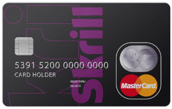

**Only idiots work for free! (c)**

[](https://github.com/RichardLitt/standard-readme)
[](https://en.cryptobadges.io/donate/1KvWrbLhuzk8DSb2Yq2948bMj3uQvVTQCW)
[](https://en.cryptobadges.io/donate/0xE42f2d4D4aF888Ac784ED26a68E828475A4712Cb)

---

# General information

 - Registration and membership in the Dragon Team cost **$5 per month** or **$50 a subscription for a year**.

   When subscribing for a year your discount 10$.

 - For registration, you need to send the following data to E-mail: wip.kernel@gmail.com:

   1. Full Name
   2. E-Mail address
   3. Receipt of payment
   4. Command output **$sudo dmidecode > dmidecode.txt**

You will receive the key and activation information to your E-mail.

---

# Payment of membership in Dragon Team


**The first payment option:**

[]()

Sign up to [Skrill](https://account.skrill.com/signup?rid=112159280) payment service and transfer funds to my account - wip.kernel@gmail.com

On this service, you can exchange cryptocurrency for transfer money.

Registration and work with the service are free.


**Second payment option:**

[]()

**Transfer in RUB:**

```
 БИК 044525444 
 Корр/счет 30103810945250000444 
 в Отделении 3 Главного управления Центрального Банка РФ 
 по Центральному федеральному округу г. Москва 
 Лицевой счет 30232810400000000003 
 Назначение платежа: пополнение кошелька 410013794063623

Или прямой перевод с вашего кошелька на кошелек Yandex.Money 410013794063623
```

**Transfer in USD:**

```
 Intermediary Bank 
 CITIBANK NA 
 Intermediary’s Bank Address 
 NEW YORK USA 
 Intermediary’s Bank SWIFT
 CITIUS33 

 BANK OF BENEFICIARY:
 SWIFT: JSNMRUMM 
 “Bank Otkritie Financial Corporation” 
 (Public Joint-Stock Company) 
 MOSCOW, RUSSIA 
 BENEFICIARY: Yandex.Money, NBCO LLC 
 ACCOUNT: 30109840100000985930 
 
Purpose of payment: purse replenishment 410013794063623
```

**Transfer in EUR:**

```
 BANK OF BENEFICIARY: 
 SWIFT: JSNMRUMM 
 “Bank Otkritie Financial Corporation” 
 (Public Joint-Stock Company) 
 MOSCOW, RUSSIA. 
 BENEFICIARY: Yandex.Money, NBCO LLC 
 ACCOUNT: 30109978000000985928 
 
Purpose of payment: purse replenishment 410013794063623
```

---

# Product Activation

Product activation is an anonymous, secure, and hassle-free process designed to deter unlicensed use packages of Dragon Team.

---

# What is product activation? 

 Product activation is an anonymous, secure, and hassle free process that authenticates licensed users during the installation process.
The process verifies that the serial number is legitimate, and has not been activated on more systems than allowed by the End-User License Agreement (EULA).
It does not affect the ability of licensed users to use their software the way they have always done.

---

# What happens during product activation? 
 
 Product activation is a series of simple steps that takes place upon first launch of your Dragon Team product. 
Users enter their serial number, which is authenticated with the Dragon Team product activation system to activate the product. 
The entire activation process is quick and easy, and the majority of users will experience product activation only once.

---

# How soon must I activate my product?

 You must activate your product within 30 days after you first installed and launched your Dragon Team product. 
(Users working with an evaluation license equipped with product activation will have different timing requirements for the activation step).

---

# How does product activation work? 

 The activation process uses minimal information about the product and system to create a request for a product license. 
The license request is composed of the product's serial number, name, version and language along with the operating system name, version and language. 
In addition, a Hardware ID and Activation ID are created.

The Hardware ID is a mathematically computed one-way hash based on your computer's hard drive geometry and CPU family, and cannot be used to identify 
the make or model of your computer or its components. The Hardware ID is only used as an identifier for the machine, and never sent to Dragon Team.

The Activation ID is a 64-bit random number which is then down sampled to reduce the size of the activation request code. 
The Activation ID is only used to identify an individual activation request and contains no information about the product or hardware.

The license request is sent to Dragon Team either through a secure (SSL) Internet connection or by email. If the request is valid, 
a valid license is returned that enables the product immediately. The activation process is completely anonymous and never requests, 
collects, or transmits personal information. It does not scan your hard drive, and none of the information collected can be used to 
identify your individual hardware components.

---

# What happens if the activation server is unavailable when I try to activate? 

 In the unlikely event that the activation servers are unavailable, the customer will be asked to try back at a later time. 

---

# What does Dragon Team do with the computer-specific information sent during the product activation process? 

 We use the computer-specific information only to verify that your product is used within the scope allowed by the End-User License Agreement (EULA). 
The information is stored in a database used only for product activation data.

---

# Why is Dragon Team requiring customers to activate their software? 

 Product activation is a simple way to reduce and deter unauthorized use and casual copying of Dragon Team products with a minimal effect on our loyal customers

---

# Do I need to be online to use Dragon Team software that includes activation? 

Activation is a onetime process which does require that you have Internet or email access. Once you have activated, 
you do not need to be online to use your software. If you wish to transfer a license, or repair your activation, 
you must be connected to the Internet or send request via email.

---

# Does product activation make the software harder to use? 

Product activation is a simple one-time process. Most users activate their software as soon as they install it, and never have to worry about it again.

---

# Does product activation slow down my computer? 

 No. The core technology of product activation only runs when you run your Dragon Team software, and will have no noticeable effect on the overall performance of your computer.

---

# How long does product activation take to complete? 
 
 Product activation is a one-time process that is typically completed immediately after installation of the software. 
Internet activation typically takes 30 seconds  to complete.

---

# What information is collected and transmitted in the product activation process? 
 
We collect the minimum information required to successfully verify the product license for each product installation, 
which includes: the product serial number, name, version, and language; the operating system name, version, and language; 
and your computer’s processor and hard-disk type. This information is combined, encrypted, and then sent to Dragon Team for verification.

---

# Does the activation process ever send data to Dragon Team after I activate my product? 

 No. Activation is a secure and anonymous one-time process. After activation is complete, the license manager runs alongside the 
product for the sole purpose of verifying the integrity of the license file and the validity of the product license. 
The activation technology in the product never contacts Dragon Team except with your express knowledge and consent.

We use the industry-standard Secure Sockets Layer (SSL) to transmit data to product activation servers that are both 
physically secure and have limited employee access.


***


## Donate

[](https://en.cryptobadges.io/donate/1KvWrbLhuzk8DSb2Yq2948bMj3uQvVTQCW)
[](https://en.cryptobadges.io/donate/0xE42f2d4D4aF888Ac784ED26a68E828475A4712Cb)

***

